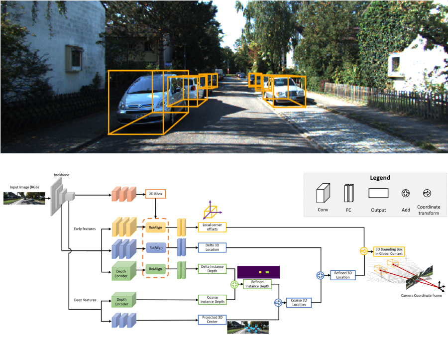

## MonoGRNet: A Geometric Reasoning Network for 3D Object Localization

#### This repository contains an implementation of our [AAAI Oral Paper](https://arxiv.org/abs/1811.10247).

[](https://cloud.tsinghua.edu.cn/f/194ddabfd05d4dc78b9f/)

#### [Video Demo](https://cloud.tsinghua.edu.cn/f/194ddabfd05d4dc78b9f/)

#### [Detection Outputs on KITTI Validation Set](https://cloud.tsinghua.edu.cn/f/57dbe05ad60b4e3c8e64/?dl=1)

### Prerequisites
- Ubuntu 16.04
- Python 2.7
- Tensorflow 1.4.0

### Dataset
Download the [Kitti Object Detection Dataset](http://www.cvlibs.net/datasets/kitti/eval_object.php?obj_benchmark=3d) and place it into `data/KittiBox`. The folder should be in the following structure:
```
data
    KittiBox
        training
            calib
            image_2
            label_2
        train.txt
        val.txt
```
The train-val split `train.txt` and `val.txt` are contained in this repository.

### Install 
Compile the Cython module and download the pretrained model:
```bash
python setup.py
```

### Training and evaluation
Run the training script and specify the GPU to use:
```bash
python train.py --gpus 0
```
The evaluation is done during training. You can adjust the evaluation intervals in `hypes/kittiBox.json`.

### Acknowledgement
We would like to thank the authors of [KittiBox](https://github.com/MarvinTeichmann/KittiBox) for their code.


