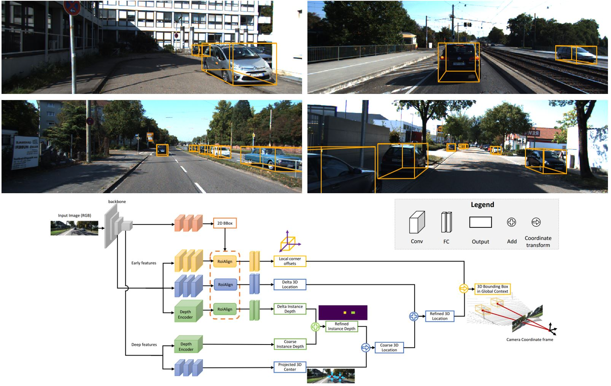

## MonoGRNet: A Geometric Reasoning Network for 3D Object Localization

[](https://cloud.tsinghua.edu.cn/f/194ddabfd05d4dc78b9f/)

#### Created by [Zengyi Qin](http://www.qinzy.tech/), Jinglu Wang and Yan Lu. The repository contains an implementation of this [AAAI Oral Paper](https://arxiv.org/abs/1811.10247).

#### [Video Demo](https://drive.google.com/file/d/1acr-Wkt52NgKp8ol8OMGp-0AxEtkl9Ur/view?usp=sharing) | [Detection Outputs on KITTI Validation Set](https://drive.google.com/file/d/16xJZqpe45XbvmZqoF0OJ8gTK4A3YIaka/view?usp=sharing)

<br/>

### Related Project
[**Triangulation Learning Network: from Monocular to Stereo 3D Object Detection**](https://github.com/Zengyi-Qin/TLNet)

Please cite this paper if you find the repository helpful:
```
@article{qin2019monogrnet, 
  title={MonoGRNet: A Geometric Reasoning Network for 3D Object Localization}, 
  author={Zengyi Qin and Jinglu Wang and Yan Lu},
  journal={The Thirty-Third AAAI Conference on Artificial Intelligence (AAAI-19)},
  year={2019}
}
```

### Prerequisites
- Ubuntu 16.04
- Python 2.7
- Tensorflow 1.4.0

### Install
Clone this repository
```bash
git clone https://github.com/Zengyi-Qin/MonoGRNet.git
```

Download the [Kitti Object Detection Dataset](http://www.cvlibs.net/datasets/kitti/eval_object.php?obj_benchmark=3d) ([image](http://www.cvlibs.net/download.php?file=data_object_image_2.zip), [calib](http://www.cvlibs.net/download.php?file=data_object_calib.zip) and [label](http://www.cvlibs.net/download.php?file=data_object_label_2.zip)) and place it into `data/KittiBox`. The folder should be in the following structure:
```
data
    KittiBox
        training
            calib
            image_2
            label_2
        train.txt
        val.txt
```
The train-val split `train.txt` and `val.txt` are contained in this repository.
 
Compile the Cython module:
```bash
python compile_cython.py
```

Download the pretrained model from [this link](https://drive.google.com/file/d/1sLOpKN9Vc40miE5lAWielxabRhizZ0x9/view?usp=sharing) and extract.

### Training and evaluation
Run the training script and specify the GPU to use:
```bash
python train.py --gpus 0
```
The evaluation is done during training. You can adjust the evaluation intervals in `hypes/kittiBox.json`.

### Visualization
```bash
cd visualize && mkdir visualize
python visualize.py
```

### Acknowledgement
We would like to thank the authors of [KittiBox](https://github.com/MarvinTeichmann/KittiBox) for their code.


